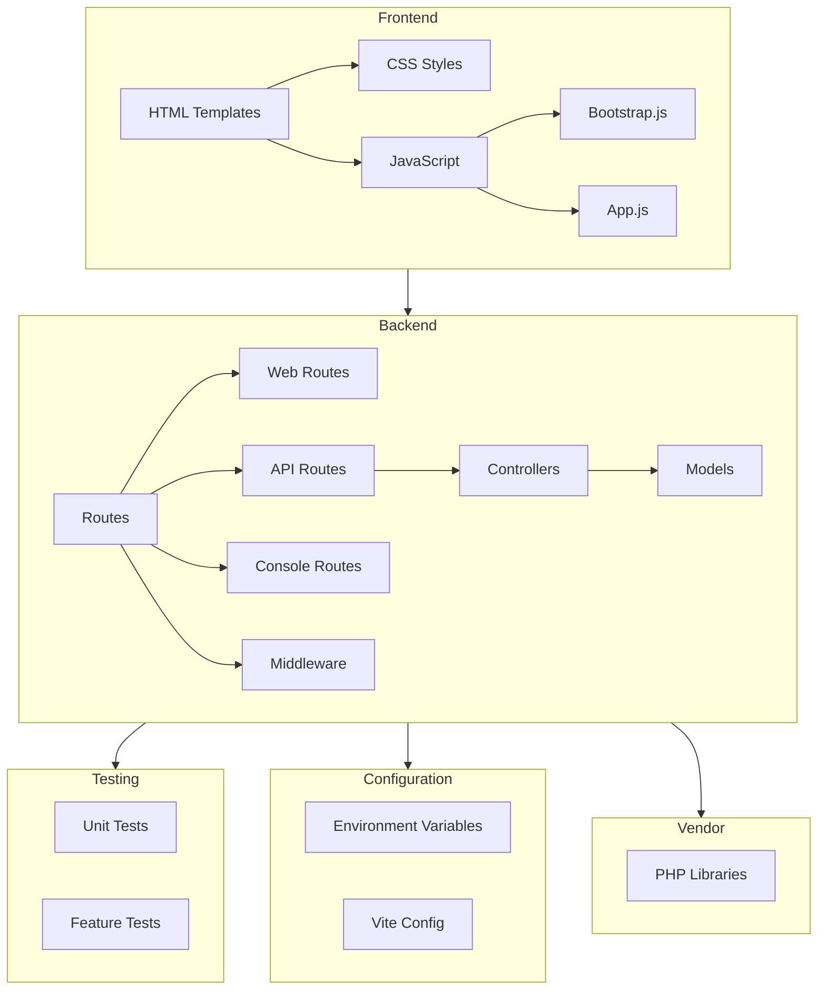

    

    <b>Automatic Architecture Diagrams from Code</b> 
    <a href="https://github.com/swark-io/swark">GitHub</a> • <a href="https://swark.io">Website</a> • <a href="mailto:contact@swark.io">Contact Us</a>

## Usage Instructions

1. **Render the Diagram**: Use the links below to open it in Mermaid Live Editor, or install the [Mermaid Support](https://marketplace.visualstudio.com/items?itemName=bierner.markdown-mermaid) extension.
2. **Recommended Model**: If available for you, use `claude-3.5-sonnet` [language model](vscode://settings/swark.languageModel). It can process more files and generates better diagrams.
3. **Iterate for Best Results**: Language models are non-deterministic. Generate the diagram multiple times and choose the best result.

## Generated Content
**Model**: GPT-4o - [Change Model](vscode://settings/swark.languageModel)  
**Mermaid Live Editor**: [View](https://mermaid.live/view#pako:eNp9k8tywiAUhl-FYa19gCw647VRk9Y2qV2QLtAcIy2BDDnYcRzfvRh1klQtO_7vXH7gsKcrnQL1aKIyw4sNiYeJIm6VdnkSxkYrBJWe5OPqMT8OAxJDXkiOUH6SbveR9NkgikiEO-mURnAFB2zKtzxaGVFgAw4qOGR9rbFE1-7hq7zCI9YrGqCy8sdjn6--WxbH7E1bbBkZV8We2AcsyR3os958cg9O2ECrUku4DpgeERotJZim7leJ01qYsdDdtmzlVjGzWghYKNJUwg83cGUiuH8HMZQoVFZnhOxdCaz0ZsNnNgaO1kCL3KroDrUWmTUchVZ1gRc2UlvhpiIHhWTBjeDL9pvP2UIgnPP_abBwojZ13iub-3MSiKVxReGGtcssngau-ejnTQVaN9EENw7UxBc7tENzMDkXqfsX-4TiBnJIqEcSmsKaW4kJPbggW6Ru_IeCu9Pk1ENjoUO5RR3t1OqyN9pmG-qtuSzh8Aua2gZI) | [Edit](https://mermaid.live/edit#pako:eNp9k8tywiAUhl-FYa19gCw647VRk9Y2qV2QLtAcIy2BDDnYcRzfvRh1klQtO_7vXH7gsKcrnQL1aKIyw4sNiYeJIm6VdnkSxkYrBJWe5OPqMT8OAxJDXkiOUH6SbveR9NkgikiEO-mURnAFB2zKtzxaGVFgAw4qOGR9rbFE1-7hq7zCI9YrGqCy8sdjn6--WxbH7E1bbBkZV8We2AcsyR3os958cg9O2ECrUku4DpgeERotJZim7leJ01qYsdDdtmzlVjGzWghYKNJUwg83cGUiuH8HMZQoVFZnhOxdCaz0ZsNnNgaO1kCL3KroDrUWmTUchVZ1gRc2UlvhpiIHhWTBjeDL9pvP2UIgnPP_abBwojZ13iub-3MSiKVxReGGtcssngau-ejnTQVaN9EENw7UxBc7tENzMDkXqfsX-4TiBnJIqEcSmsKaW4kJPbggW6Ru_IeCu9Pk1ENjoUO5RR3t1OqyN9pmG-qtuSzh8Aua2gZI)

