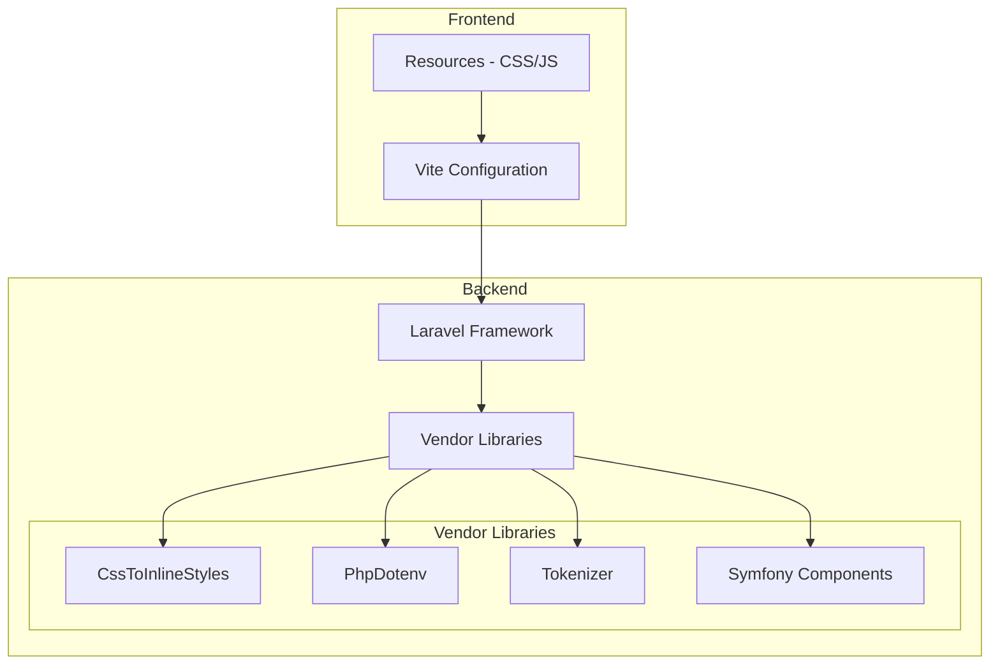

    

    <b>Automatic Architecture Diagrams from Code</b> 
    <a href="https://github.com/swark-io/swark">GitHub</a> • <a href="https://swark.io">Website</a> • <a href="mailto:contact@swark.io">Contact Us</a>

## Usage Instructions

1. **Render the Diagram**: Use the links below to open it in Mermaid Live Editor, or install the [Mermaid Support](https://marketplace.visualstudio.com/items?itemName=bierner.markdown-mermaid) extension.
2. **Recommended Model**: If available for you, use `claude-3.5-sonnet` [language model](vscode://settings/swark.languageModel). It can process more files and generates better diagrams.
3. **Iterate for Best Results**: Language models are non-deterministic. Generate the diagram multiple times and choose the best result.

## Generated Content
**Model**: GPT-4o - [Change Model](vscode://settings/swark.languageModel)  
**Mermaid Live Editor**: [View](https://mermaid.live/view#pako:eNpdkc1uwjAQhF_F8hnUew6VSAK0FYeqQVzsHkyyIRaxN_IPVYp495qEgsnevp3R2Lt7piVWQBPK9cGIriHbnGsSyvr92FgZ1A50NbavtWBfYNGbEiyZk6woXj6K74ecsp10QDLUtTx4I5xEfZOHmEl-KsrjU3zGNsKIE7ThaaHgB80xSs_ZLrjRkI3cG2Ek2Ei8h049D8u1liyzdovvupUaCte3TyHXWrHPpssxzH2aKGu2xfBf-Qtmoryxolc16j6MrjrUoF0ce58xWsKCzOevJB0hHSAbIRvgdot8gGUMqxjWMbxxTWdUgVFCVuGwZ05dAwo4TQinFdTCt47TSzD5rhIOcinC0hRNnPEwo8I7LHpd_rNBf2hoUovWwuUPwmqkYA) | [Edit](https://mermaid.live/edit#pako:eNpdkc1uwjAQhF_F8hnUew6VSAK0FYeqQVzsHkyyIRaxN_IPVYp495qEgsnevp3R2Lt7piVWQBPK9cGIriHbnGsSyvr92FgZ1A50NbavtWBfYNGbEiyZk6woXj6K74ecsp10QDLUtTx4I5xEfZOHmEl-KsrjU3zGNsKIE7ThaaHgB80xSs_ZLrjRkI3cG2Ek2Ei8h049D8u1liyzdovvupUaCte3TyHXWrHPpssxzH2aKGu2xfBf-Qtmoryxolc16j6MrjrUoF0ce58xWsKCzOevJB0hHSAbIRvgdot8gGUMqxjWMbxxTWdUgVFCVuGwZ05dAwo4TQinFdTCt47TSzD5rhIOcinC0hRNnPEwo8I7LHpd_rNBf2hoUovWwuUPwmqkYA)

