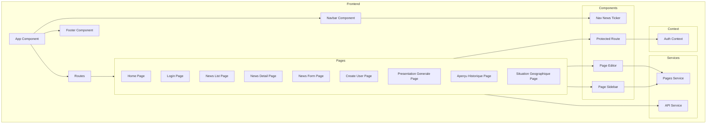

    

    <b>Automatic Architecture Diagrams from Code</b> 
    <a href="https://github.com/swark-io/swark">GitHub</a> • <a href="https://swark.io">Website</a> • <a href="mailto:contact@swark.io">Contact Us</a>

## Usage Instructions

1. **Render the Diagram**: Use the links below to open it in Mermaid Live Editor, or install the [Mermaid Support](https://marketplace.visualstudio.com/items?itemName=bierner.markdown-mermaid) extension.
2. **Recommended Model**: If available for you, use `claude-3.5-sonnet` [language model](vscode://settings/swark.languageModel). It can process more files and generates better diagrams.
3. **Iterate for Best Results**: Language models are non-deterministic. Generate the diagram multiple times and choose the best result.

## Generated Content
**Model**: GPT-4o - [Change Model](vscode://settings/swark.languageModel)  
**Mermaid Live Editor**: [View](https://mermaid.live/view#pako:eNp9VEtOwzAQvYrlNVygC6SKUkBCqKKwcrowydBaNHbwp4AqzsNBuBi2x3HiRrBoPPPejOfn6ZHWqgE6o5Xcat7tyOOikoQY94zqUitpQTYBJGTedcz_yKVqOyVB2g3i9_zwzDXDY8IulbKgGR4T9kE5C4bhkbAcfsW3YBAj5Ea1wMInwpsevlNbIVn8lsQ9vJs7YSwLAgnSlF-A5WKPFihPbZZKt2gRpJK_1MAtPBlfH4okyKXNSoPx9XIrlLwGCZrvgY1B0qOl37wDXbsbn7fS4s0BC8DPtyMDVDqshXUpior9i14ZJWN47Jnnm_ueh2SGIvz0agtNHBTLKs5vqNXfetUInx4LIkG5oNeigfBaIp-Uod_8EDr9KOpXiA8qToCg_k-6_pF-2Nw4Z3cJYkHu-T_916APoh5e2rwTCWLz1W1PF1WY3iAqJyYpQjyCEHbm_Pwi7ckYwaUYI7gIAUEpgnkPMFqEioGccHkKUzx1PBBpX1NmQ9-jU3F9tBm1tb8Wgwwppjb0dIr1J49ZDd2uJD2jLeiWi8b_Jx0ranfQQkVnpKINvHC3txX98kaua_yyLQT3A2zpzGoHZ5Q7q9afsu51rdx2R2cvfG_g6xdTnKjP) | [Edit](https://mermaid.live/edit#pako:eNp9VEtOwzAQvYrlNVygC6SKUkBCqKKwcrowydBaNHbwp4AqzsNBuBi2x3HiRrBoPPPejOfn6ZHWqgE6o5Xcat7tyOOikoQY94zqUitpQTYBJGTedcz_yKVqOyVB2g3i9_zwzDXDY8IulbKgGR4T9kE5C4bhkbAcfsW3YBAj5Ea1wMInwpsevlNbIVn8lsQ9vJs7YSwLAgnSlF-A5WKPFihPbZZKt2gRpJK_1MAtPBlfH4okyKXNSoPx9XIrlLwGCZrvgY1B0qOl37wDXbsbn7fS4s0BC8DPtyMDVDqshXUpior9i14ZJWN47Jnnm_ueh2SGIvz0agtNHBTLKs5vqNXfetUInx4LIkG5oNeigfBaIp-Uod_8EDr9KOpXiA8qToCg_k-6_pF-2Nw4Z3cJYkHu-T_916APoh5e2rwTCWLz1W1PF1WY3iAqJyYpQjyCEHbm_Pwi7ckYwaUYI7gIAUEpgnkPMFqEioGccHkKUzx1PBBpX1NmQ9-jU3F9tBm1tb8Wgwwppjb0dIr1J49ZDd2uJD2jLeiWi8b_Jx0ranfQQkVnpKINvHC3txX98kaua_yyLQT3A2zpzGoHZ5Q7q9afsu51rdx2R2cvfG_g6xdTnKjP)

