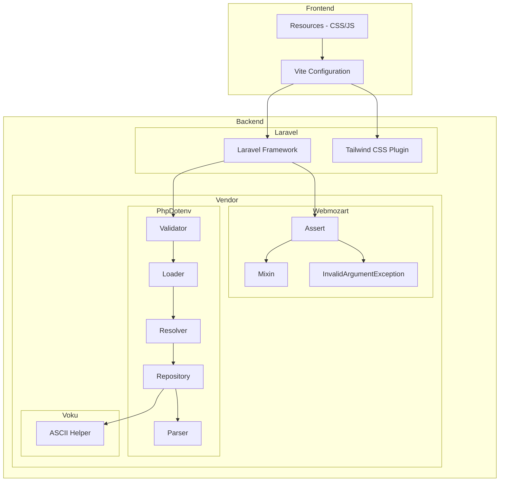

    

    <b>Automatic Architecture Diagrams from Code</b> 
    <a href="https://github.com/swark-io/swark">GitHub</a> • <a href="https://swark.io">Website</a> • <a href="mailto:contact@swark.io">Contact Us</a>

## Usage Instructions

1. **Render the Diagram**: Use the links below to open it in Mermaid Live Editor, or install the [Mermaid Support](https://marketplace.visualstudio.com/items?itemName=bierner.markdown-mermaid) extension.
2. **Recommended Model**: If available for you, use `claude-3.5-sonnet` [language model](vscode://settings/swark.languageModel). It can process more files and generates better diagrams.
3. **Iterate for Best Results**: Language models are non-deterministic. Generate the diagram multiple times and choose the best result.

## Generated Content
**Model**: GPT-4o - [Change Model](vscode://settings/swark.languageModel)  
**Mermaid Live Editor**: [View](https://mermaid.live/view#pako:eNp9k01zgjAQhv9KJuc6vXvoDKJW_JhximMPwcMWVswICRMSbev43xuCrVBo9_bsu7y7yYYLjWWCdEgjkSooDmQzjgSxUZq3OjFVUmgUSZ2uwmMvWEqjYizJgPhh-DgPd3d5xLZcI_Gl2PPUKNBcipvsbH75jyA-tux_lCUoOGF2V6rw2S1tB4Mcz1Idd-2KMdsAz85cJNVsZJ2ZlItGTWOIVrutFaRqe_2Ir_iWy09Quq1XMWFeWaLSu640ZSv-3mr-Hc8sECfIeOKp1OQo9OQ9xqJxVX9M2xpqfSjG0u7m1PWfsW3lDlqqnu4BW0pIsE-au-Vmp15xYcVClty6fvTIS7YGVXa-_O8IW3k0XaMV80I_CMgMs6LfrgONJh4ZDJ7IqIaRA78JtxfuO5jUMHEwbcJzs2xWw8xBUEPgYF7D3MGihoWDZRNWkaAPNEeVA0_s_3aJqD5gjhEdkogmuAeT6YhebZEp7N5wzMFeUU6HWhl8oGC0DD9E_M1KmvRAh3vISrx-AZ8IA94) | [Edit](https://mermaid.live/edit#pako:eNp9k01zgjAQhv9KJuc6vXvoDKJW_JhximMPwcMWVswICRMSbev43xuCrVBo9_bsu7y7yYYLjWWCdEgjkSooDmQzjgSxUZq3OjFVUmgUSZ2uwmMvWEqjYizJgPhh-DgPd3d5xLZcI_Gl2PPUKNBcipvsbH75jyA-tux_lCUoOGF2V6rw2S1tB4Mcz1Idd-2KMdsAz85cJNVsZJ2ZlItGTWOIVrutFaRqe_2Ir_iWy09Quq1XMWFeWaLSu640ZSv-3mr-Hc8sECfIeOKp1OQo9OQ9xqJxVX9M2xpqfSjG0u7m1PWfsW3lDlqqnu4BW0pIsE-au-Vmp15xYcVClty6fvTIS7YGVXa-_O8IW3k0XaMV80I_CMgMs6LfrgONJh4ZDJ7IqIaRA78JtxfuO5jUMHEwbcJzs2xWw8xBUEPgYF7D3MGihoWDZRNWkaAPNEeVA0_s_3aJqD5gjhEdkogmuAeT6YhebZEp7N5wzMFeUU6HWhl8oGC0DD9E_M1KmvRAh3vISrx-AZ8IA94)

