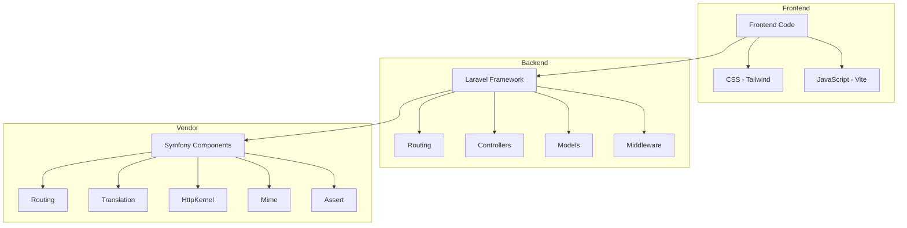

    

    <b>Automatic Architecture Diagrams from Code</b> 
    <a href="https://github.com/swark-io/swark">GitHub</a> • <a href="https://swark.io">Website</a> • <a href="mailto:contact@swark.io">Contact Us</a>

## Usage Instructions

1. **Render the Diagram**: Use the links below to open it in Mermaid Live Editor, or install the [Mermaid Support](https://marketplace.visualstudio.com/items?itemName=bierner.markdown-mermaid) extension.
2. **Recommended Model**: If available for you, use `claude-3.5-sonnet` [language model](vscode://settings/swark.languageModel). It can process more files and generates better diagrams.
3. **Iterate for Best Results**: Language models are non-deterministic. Generate the diagram multiple times and choose the best result.

## Generated Content
**Model**: GPT-4o - [Change Model](vscode://settings/swark.languageModel)  
**Mermaid Live Editor**: [View](https://mermaid.live/view#pako:eNp9UstuAjEM_JUo5_IDe6gEu6U8e-giLkkP7sZARB4rbwJCiH9vyhaVNlV9y4ztGds588Yr5AWXbkvQ7tiqko6l6OJ7D4zJu4BO9fBnDMUNY2Uqfrtj2GDwyEairGs2YCvQ5qidyhJKMYMD1A3pNqS8tQ63JledXwZG0Ox_6FdiAQQHNMkbWDx62t9JVFeJJ_HqY9BumzFjUSbz5I1B6jL2WSzTSCYnJmKplTJ4BPrP7DqBnr6Lp6I-2Y13p7Qq23qHLtz3nl57z_4w2zNzsSJwnYGgvcvYhZiE0M6RHJqMXCbDFjP4RQy7DinkM_S3-Tp_P_RUOv7ALZIFrdInOUsedmhR8oJJrnAD0QTJLykptgoCVhrSHiwvAkV84BCDr0-uub3Jx-2OFxswHV4-APx5ubY) | [Edit](https://mermaid.live/edit#pako:eNp9UstuAjEM_JUo5_IDe6gEu6U8e-giLkkP7sZARB4rbwJCiH9vyhaVNlV9y4ztGds588Yr5AWXbkvQ7tiqko6l6OJ7D4zJu4BO9fBnDMUNY2Uqfrtj2GDwyEairGs2YCvQ5qidyhJKMYMD1A3pNqS8tQ63JledXwZG0Ox_6FdiAQQHNMkbWDx62t9JVFeJJ_HqY9BumzFjUSbz5I1B6jL2WSzTSCYnJmKplTJ4BPrP7DqBnr6Lp6I-2Y13p7Qq23qHLtz3nl57z_4w2zNzsSJwnYGgvcvYhZiE0M6RHJqMXCbDFjP4RQy7DinkM_S3-Tp_P_RUOv7ALZIFrdInOUsedmhR8oJJrnAD0QTJLykptgoCVhrSHiwvAkV84BCDr0-uub3Jx-2OFxswHV4-APx5ubY)

